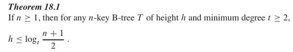
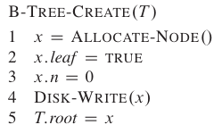
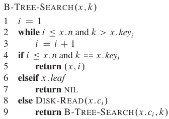
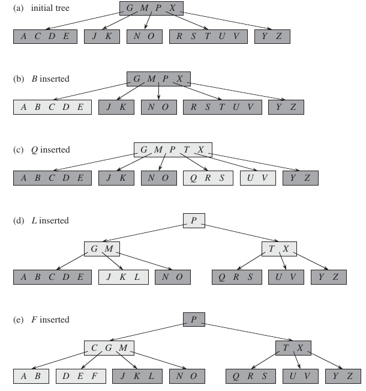
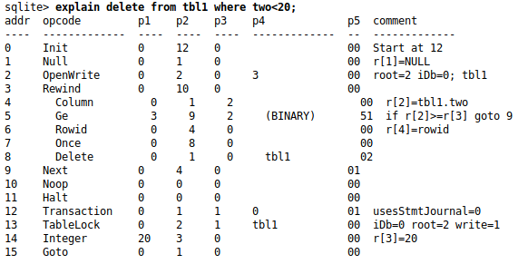

# Data-Base-in-C

This project implements a little database in C, following the architecture of the [SQLite](https://www.sqlite.org/arch.html) software. The Btree was adapted from [falcaopetri](https://github.com/falcaopetri/B-Tree) implementation.

This is a project for the lecture of Computers Programming II, of the Electronic Engineering course of the Federal Institute of Education, Science and Technology of Santa Catarina (IFSC), Brazil. 

To test the code, run the makefile in the folder “main project”.

# Btrees

* keys are kept in sequential ordering
* the tree holds a hierarchical indexing
* ensures balance

### aplications

* Most of the tree operations (search, insert, delete, max, min, ..etc ) require O(h) (where h is the height of the tree).
* The hight of the B-tree is lower than from red-black ad other. The height of B-Trees is kept low by putting maximum possible keys in a B-Tree node.
* Traversing a range of values is fast (unlike a hash map)
* Used when $accessTime >> processTime$ 
* practical B-trees have large number of child nodes

### relation with the hardware

* é mais rápido acessar dados (da memória secundária) quando eles estão proximos (have good locality) 
* B-trees solve this problem by grouping what would be many nodes together into a single giant node. That improve the locality and avoid the malloc overhead. That take advantage of the block structure of memory devices
* Generally, a B-Tree node size is kept equal to the disk block size

### Main concepts

* The keys are in increasing order. Subtrees are between two keys are between the range of those two

* O numero de filhos de um nó pode ter possui um range (lower and upper bounds)

* Keys: separation values. The subtrees (childs ) of that node will be "inserted" beetween those values, obedecendo a sequência da valores

* Se voce vai inserir e utrapassa o range, divida o nó em dois. If you will delete and the node will stay with less than the minimu range, join two nodes.

* $numberOfChilds = numberOfKeys + 1$

* k = number of keys of the node 

* The root of the B-tree is always in main memory, so that we never need to
	perform a disk-read on the root

* A altura só aumenta quando o root split 

* **minimum degree (t)**

	* minimum number of childs (Internal nodes have at least t childs)
	* min number of keys: t -1
	* max number of keys: 2t-1
	* max number of childs (also called *max degree*): 2t

* **order (m)**

	* other way of characterize a B-tree (rather than minimum degree)
	* Max number of keys 
	* $m=2t-1$
	* min number of keys: m/2

* **height**

	* B-trees are always completely balanced, with each leaf the same distance from the root. 

	* every n-node has height O(lg n)

		

### Creation

* Just allocate and initialize 

* $O(1)$

	

### Search

* B-T REE -S EARCH is a straightforward generalization of the T REE -SEARCH pro-
	cedure defined for binary search trees

* We’ll need $O(log_t n)$ disk access until find the node 

* **Algorithm**

	* Receive a node X and a key K to be searched
	* Do a linear search to reach the expected position of the key K
	* If we find it there, return it
	* If it’s a leaf (non K), so K isn’t in the tree
	* if it is not a leaf (but non K too), so search again in that subtree

	

### Insertion

* Just go to the right leaf and insert it! 

* If the leaf if full

* split around its median key 

* The median key moves up into y’s parent

* If the parent if full, split again and again

* In the algorithm we already split the full nodes while going down (because we cant go up the tree)

* The Cormen algorithm use a main function B-tree-insert(), witch calls a recursive function B-tree-insert-non-full (). When necessary, B-tree-split-child ()

* Illustration for a tree with t=3

	

### Deletition

* it's complicated to delete a key from an internal node; the solution is to delete a key from a nearby leaf instead

* If the leaf is “empty” (less than the minumum degree), merge
* já vai juntando na descida 

### B+trees
* stores all data in the leaves of the tree.
* Used to store the data in a database
* Permite agrupar todo o roteamento de memória do bano de dados em poucos blocos de memória

# How SQLite works

### SQL processor

* read a string with the SQL statement and return a bytecode

* **Tokenizer**

	* Breaks the text in tokens 

* **Parser**

	* interprets the tokens to generate a tree, that represents the statement to be executed

* **Code generator**

	* Transform the parsed tree into bytecode.
	* That is not a straight foward translation, because the planning of query must be done in the low level implementation. 
	* The query is optimized using IA to choose the best low level algorithm 
	* The final bytecode is also called *prepared statement*

* **Bytecode**

	* Also called *Virtual DataBase Engine*

	* Sequence of instructions (they are very similar to assembly) that determines what and how the query will be executed 

	* Each instruction has an opcode and five operands named P1, P2  P3, P4, and P5.

	* The actual SQLite have 171 instructions 

	* The bytecode engine change from one release of SQLite to the next

	* Cursors: pointer abstraction to the  virtual machine. There are cursors to the tables, rows, cell, etc. All cursors operate independently

	* Example of bytecode (obtained adding the *explain* prefix in the query):

		

### Page

* definem a organização de memória da página
* Em um banco de dados real, as páginas são otimizadas para terem o mesmo tamanho do bloco de memória do disco. Para isso, cada página armazena mais de uma linha.
* Para mapear a memória (lembre-se que o squema do banco de dados será determinado em tempo de execução), cada página possui um header com os offsets (em bytes) de cada variável. Isso adiciona um pequeno overheah espacial, mas permite o mapeamento da memória	
* Todas as páginas de um banco de dados possuem o mesmo tamanho 
* O tamanho da page varia de 512 a 65536 bytes (default é 4096 bytes).
* **Overflow pages**
	* When the date is to large to the page, they are stored in overflow pages (apart from the Btree)
	* ==The overflow pages are organized in a linked list==

### Btree

* The b-tree algorithm provides key/data storage with unique and ordered keys
* Float values are stored as integer and converted back to float when stracted from the disk. The same happen with other values (like strings) that can be converted to integer without loss of information
* **where is used**
	* The tables are stored using a B+tree (also called tables Btress). Each table row is a Btree entry
	* There is one b+trees for each column in the database schema (to allow search not only by the id)
	* There are no b-trees associated with virtual tables
	* There is one Btree in the database file for each index in the schema
	* Btrees are also used to store system information (like the sqlite_master table)
* **indexing**
	* A significant improvement in databases can be made with index
	* Can be explicitly declared via a [CREATE INDEX](https://www.sqlite.org/lang_createindex.html) statement or implied by a UNIQUE or PRIMARY KEY constraint
	* The query planner can create a temporary index to optimize the search 
	* São “tabelas” que apontam diretamente para o dado, otimizando a busca
	* Tornam a inserção de dados um pouco mais lenta (pois o DB tambem tem que criar o indice), mas otimizam a remoção de dados 
	* Each entry in the index b-tree corresponds to a single row in the 
		associated SQL table

### Other internal details

* Almost everything about the database is stored on a single file on disk called the "main database file"
* Some temporary informations are stored in a file called *rollback journal* (example: to store the backup information of a transaction, in case of failure)
* Internal files are named begining with “sqlite_”
* The schema is stored in th file sqlite_master
* A table with the name "sqlite_sequence" that is used to keep track of the maximum historical [INTEGER PRIMARY KEY](https://www.sqlite.org/lang_createtable.html#rowid) for a table using [AUTOINCREMENT](https://www.sqlite.org/autoinc.html).
* sqlite_statN (where N is an integer) store statistics 

# Useful links

### B-trees itself

https://www.cs.usfca.edu/~galles/visualization/BTree.html 
http://forums.codeguru.com/showthread.php?453150-B-Tree-C-Implementation

### Databases 

https://cstack.github.io/db_tutorial/
https://www.sqlite.org/arch.html

https://github.com/mysql/mysql-server/tree/8.0/storage